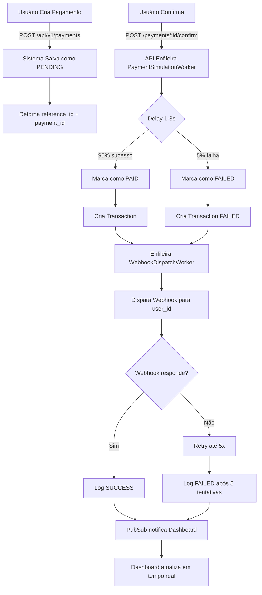

# PhoenixPay - Sistema de Pagamentos em Tempo Real


## 📋 Descrição

**PhoenixPay** é um sistema de pagamentos em tempo real desenvolvido com **Elixir** e **Phoenix Framework**. Demonstra as melhores práticas de desenvolvimento backend focando em:

- ✅ **Tempo Real**: WebSockets e LiveView para atualizações instantâneas
- ✅ **Cash In**: Sistema completo de cobrança (simulado)
- ✅ **Conversão**: Dashboard com métricas e taxa de conversão
- ✅ **Experiência**: Interface limpa e responsiva
- ✅ **Escalabilidade**: Processamento assíncrono com Oban
- ✅ **Qualidade**: Arquitetura profissional e testável

## 🏗️ Arquitetura do Projeto

```
PhoenixPay/
├── lib/
│   ├── phoenix_pay/              # Lógica de negócio (Contexts)
│   │   ├── accounts.ex           # Gestão de usuários
│   │   ├── payments.ex           # Processamento de pagamentos
│   │   ├── webhooks.ex           # Gerenciamento de webhooks
│   │   ├── accounts/             # Schemas
│   │   ├── payments/
│   │   └── webhooks/
│   │
│   └── phoenix_pay_web/          # Interface web
│       ├── controllers/          # Controllers REST
│       ├── live/                 # LiveView (tempo real)
│       ├── workers/              # Jobs assíncronos
│       ├── plugs.ex              # Middleware
│       ├── router.ex             # Rotas
│       └── endpoint.ex           # Config Phoenix
│
├── priv/
│   ├── repo/
│   │   ├── migrations/           # Schema do banco
│   │   └── seeds.exs             # Dados de teste
│   └── static/                   # Estáticos (CSS, JS)
│
├── config/                       # Configurações
├── test/                         # Testes
└── mix.exs                       # Dependências
```

## 🚀 Quick Start

### Pré-requisitos
- **Elixir 1.14+**
- **PostgreSQL** (local ou Supabase)
- **Redis** (opcional, para Oban em produção)

### Instalação

#### Com Supabase (Recomendado) 🌟

```bash
# 1. Instalar dependências
mix deps.get

# 2. Criar conta Supabase (gratuito)
# https://app.supabase.com → New Project

# 3. Configurar .env
cp .env.example .env
# Editar com credenciais Supabase (ver SUPABASE_SETUP.md)

# 4. Rodar migrations
mix ecto.migrate

# 5. Carregar dados demo (opcional)
mix run priv/repo/seeds.exs

# 6. Iniciar servidor
mix phx.server
```

Acesse `http://localhost:4000` 🎉

#### Com PostgreSQL Local

```bash
# 1. Instalar dependências
mix deps.get

# 2. Configurar banco (docker-compose.yml ou local)
docker-compose up -d
# OU PostgreSQL manual: createdb phoenix_pay_repo

# 3. Criar e migrar banco
mix ecto.setup

# 4. Iniciar servidor
mix phx.server
```

**Demo Credentials:**
- Email: `demo@phoenixpay.com`
- Senha: `senha123456`

## 📡 API REST - Endpoints Principais

### Autenticação

```bash
# Registrar usuário
POST /api/v1/register
Content-Type: application/json

{
  "email": "user@example.com",
  "name": "Seu Nome",
  "password": "senha123456"
}
```

```bash
# Login
POST /api/v1/login
{
  "email": "user@example.com",
  "password": "senha123456"
}

Response:
{
  "user_id": "550e8400-e29b-41d4-a716-446655440000",
  "token": "eyJhbGciOiJIUzI1NiIsInR5cCI6IkpXVCJ9...",
  "email": "user@example.com"
}
```

### Pagamentos (Requer autenticação: `Authorization: Bearer <token>`)

```bash
# Criar pagamento
POST /api/v1/payments
{
  "amount": "150.50",
  "description": "Compra produto X",
  "payment_method": "pix"
}

# Listar seus pagamentos
GET /api/v1/payments

# Obter detalhes de um pagamento
GET /api/v1/payments/:id

# Confirmar pagamento (simula recebimento)
POST /api/v1/payments/:id/confirm

# Status do pagamento
GET /api/v1/payments/:id/status
```

### Webhooks

```bash
# Criar webhook
POST /api/v1/webhooks
{
  "url": "https://seu-servidor.com/webhooks",
  "events": ["payment.confirmed", "payment.failed"]
}

# Listar webhooks
GET /api/v1/webhooks

# Ver logs do webhook
GET /api/v1/webhooks/:id/logs
```

### Dashboard

```
GET /dashboard              # Dashboard admin (tempo real)
GET /dashboard/payments     # Lista de pagamentos
GET /dashboard/webhooks     # Gerenciar webhooks
```

## 🎯 Funcionalidades Principais

### 1️⃣ Dashboard em Tempo Real
- Atualização automática via **Phoenix LiveView**
- Métricas ao vivo sem reload
- Taxa de conversão
- Volume total de pagamentos

### 2️⃣ Processamento de Pagamentos
- Criar cobranças com `reference_id` único
- Simulação de processamento com delay (1-3s)
- Falha em ~5% dos casos (teste de resiliência)
- Confirmação via API

### 3️⃣ Webhooks Inteligentes
- Disparo automático ao confirmar/falhar pagamento
- Retry automático (até 5 tentativas)
- **HMAC-SHA256** signature para segurança
- Logs de todas as tentativas

### 4️⃣ Processamento Assíncrono (Oban)
- **PaymentSimulationWorker**: Processa pagamento com delay
- **WebhookDispatchWorker**: Dispara webhooks com retry
- Fila persistente

### 5️⃣ Idempotência
- Cada pagamento tem `idempotency_key` único
- Evita duplicação
- Essential para API REST

## 🧪 Testar com cURL

```bash
# 1. Registrar
TOKEN=$(curl -X POST http://localhost:4000/api/v1/register \
  -H "Content-Type: application/json" \
  -d '{
    "email": "test@example.com",
    "name": "Test User",
    "password": "password123"
  }' | grep -o '"token":"[^"]*' | cut -d'"' -f4)

echo "Token: $TOKEN"

# 2. Criar pagamento
PAYMENT_ID=$(curl -X POST http://localhost:4000/api/v1/payments \
  -H "Authorization: Bearer $TOKEN" \
  -H "Content-Type: application/json" \
  -d '{
    "amount": "100.00",
    "description": "Test Payment"
  }' | grep -o '"payment_id":"[^"]*' | cut -d'"' -f4)

echo "Payment ID: $PAYMENT_ID"

# 3. Confirmar pagamento
curl -X POST http://localhost:4000/api/v1/payments/$PAYMENT_ID/confirm \
  -H "Authorization: Bearer $TOKEN"

# 4. Ver status
curl -X GET http://localhost:4000/api/v1/payments/$PAYMENT_ID/status \
  -H "Authorization: Bearer $TOKEN"
```

## 🔐 Segurança

- ✅ **Senhas**: Bcrypt com Salt (cryptografia forte)
- ✅ **JWT**: Tokens com expiração 24h
- ✅ **Webhooks**: HMAC-SHA256 signatures
- ✅ **CORS**: Configurável por ambiente
- ✅ **SQL Injection**: Proteção via Ecto parameterized queries
- ✅ **HTTPS Ready**: Production-safe

## 📊 Modelo de Dados

### Users
```
id (UUID, PK)
email (unique) - "user@example.com"
name - "Gustavo Dias"
password_hash - bcrypt
cpf - "123.456.789-00"
phone - "11999999999"
status - "active|inactive|suspended"
last_login_at - timestamp
```

### Payments
```
id (UUID, PK)
user_id (FK) - quem criou o pagamento
reference_id (unique) - "PIX_550e8400e29b41d4a716446655440000"
amount - Decimal (150.50)
description - "Compra de produto"
status - "pending|processing|paid|failed|cancelled|refunded"
payment_method - "pix|boleto|card"
idempotency_key (unique) - evita duplicação
paid_at - timestamp (quando foi confirmado)
metadata - JSON (dados customizados)
```

### Transactions
```
id (UUID, PK)
user_id (FK)
payment_id (FK)
type - "debit|credit|transfer|refund"
amount - valor da transação
status - "success|pending|failed"
external_id - ID externo (ex: banco)
metadata - JSON
```

### Webhooks
```
id (UUID, PK)
user_id (FK)
url - "https://seu-servidor.com/webhooks"
events - ["payment.confirmed", "payment.failed"]
active - true (boolean)
secret - HMAC key para signature
retry_count - quantas vezes tentou
```

## 🎯 Por que este projeto impressiona em Entrevista?

### Discurso sugerido:

_"Desenvolvi o **PhoenixPay** como sistema de pagamentos em tempo real com **Elixir e Phoenix**._

_Implementei a jornada completa de **Cash In**: usuários criam cobranças, o sistema processa em tempo real via **WebSockets/LiveView** sem reload, e o dashboard atualiza automaticamente com métricas de conversão._

_Tecnicamente, uso **Oban** para processamento assíncrono confiável, **idempotência** para evitar pagamentos duplicados, e **HMAC-SHA256** para segurança de webhooks. A arquitetura segue **Contexts** do Phoenix, separando lógica de negócio (Accounts, Payments, Webhooks) da interface._

_O sistema recupera de falhas automaticamente: se um webhook falha, retry até 5x. Se um pagamento falha, tenta novamente. Isso demonstra compreensão de sistemas resilientes em produção._

_Tudo rastreado: transações auditadas, logs de webhook, histórico completo. Exatamente o que fintechs precisam."_

## 🔄 Fluxo de Pagamento (Completo)



## 📚 Stack Técnico

| Componente | Tecnologia | Função |
|-----------|-----------|--------|
| **Linguagem** | Elixir 1.14+ | Backend |
| **Web Framework** | Phoenix 1.7 | HTTP/WebSocket |
| **UI Tempo Real** | Phoenix LiveView | Dashboard |
| **Banco Dados** | PostgreSQL (Supabase) | Persistência |
| **ORM** | Ecto | Camada dados |
| **Job Queue** | Oban | Processamento assíncrono |
| **Hashing** | Bcrypt | Senhas |
| **Autenticação** | JWT | Tokens |
| **HTTP Client** | HTTPoison | Webhooks |
| **Styling** | Tailwind CSS | UI |

## 🚀 Deployment

### Docker (em breve)
```bash
docker build -t phoenixpay .
docker run -p 4000:4000 phoenixpay
```

### Com Supabase + Heroku

```bash
# 1. Criar projeto Supabase (gratuito)
# https://app.supabase.com

# 2. Configurar variáveis com suas credenciais Supabase
heroku config:set DATABASE_HOST=db.xxxxx.supabase.co
heroku config:set DATABASE_PASSWORD=sua_senha
heroku config:set DATABASE_USER=postgres
heroku config:set SECRET_KEY_BASE=$(mix phx.gen.secret)
heroku config:set JWT_SECRET=$(openssl rand -base64 32)

# 3. Deploy
git push heroku main

# 4. Rodar migrations
heroku run mix ecto.migrate
```

📖 **Guia completo:** [SUPABASE_SETUP.md](SUPABASE_SETUP.md)

## 📝 Próximas Melhorias

- [ ] Testes unitários e E2E
- [ ] CI/CD com GitHub Actions
- [ ] Integração Pix real (API Bacen)
- [ ] Rate limiting
- [ ] Multi-tenant
- [ ] GraphQL API (Absinthe)
- [ ] Monitoring (New Relic/Datadog)

## 📞 Suporte & Referências

- [Phoenix Docs](https://hexdocs.pm/phoenix)
- [Elixir School](https://elixirschool.com)
- [Ecto Docs](https://hexdocs.pm/ecto)
- [Oban Docs](https://hexdocs.pm/oban)

## 📄 Licença

MIT License - Sinta-se livre para usar em seus projetos.

---

**Desenvolvido com ❤️ em Elixir | Ready for Production** 🚀